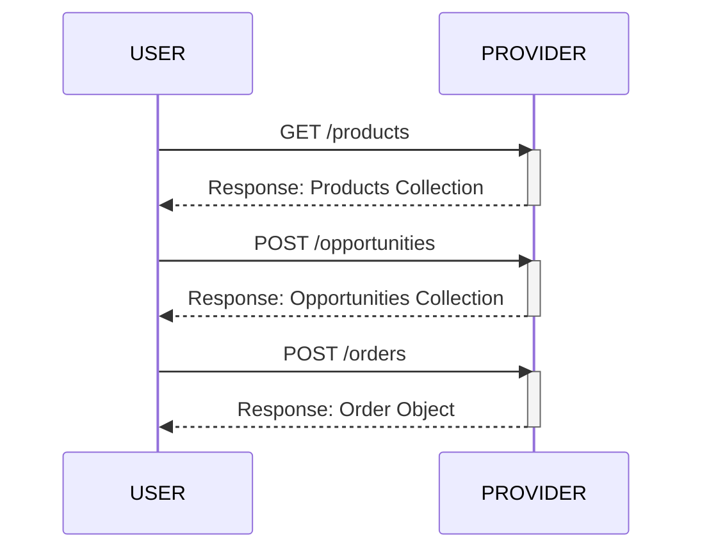
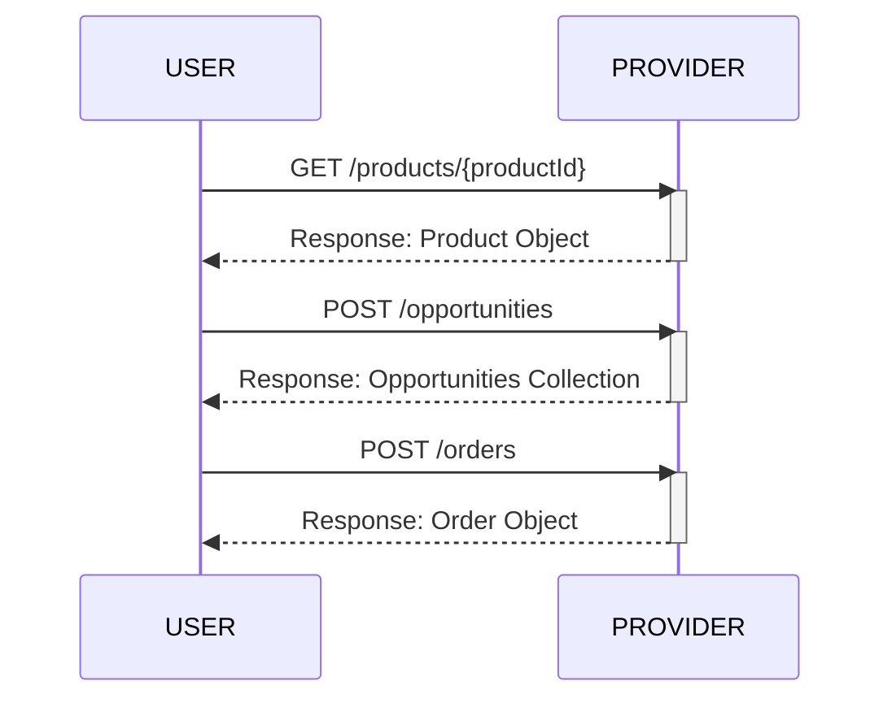
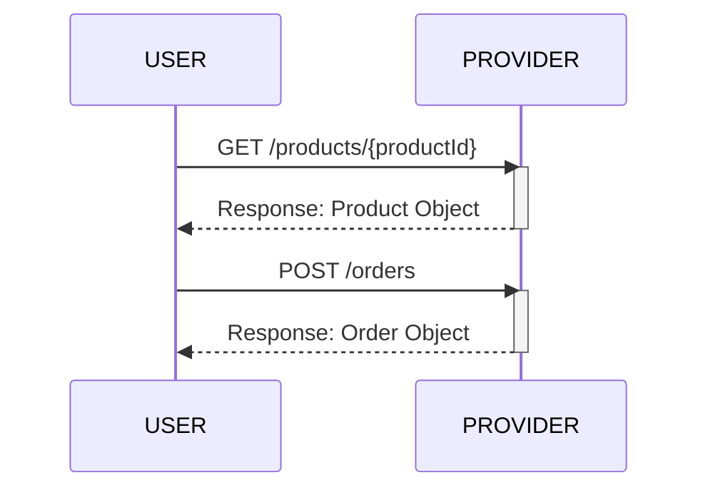

# Sensor Tasking API (STAPI)

## Table of Contents
- [Sensor Tasking API (STAPI)](#sensor-tasking-api-stapi)
  - [Table of Contents](#table-of-contents)
  - [About](#about)
  - [Introduction](#introduction)
  - [STAPI Description](#stapi-description)
    - [Core](#core)
      - [Landing Page](#landing-page)
        - [Relation Types](#relation-types)
    - [Opportunities](#opportunities)
  - [Endpoints](#endpoints)
  - [Conformance Classes](#conformance-classes)
    - [Conformance Class Table](#conformance-class-table)
  - [Example workflows](#example-workflows)

## About
The Sensor Tasking API (STAPI) defines a JSON-based web API to query for potential future data
and place orders ("tasking") for potential future data from remote sensing data providers (satellite or airborne).

STAPI takes much of the work done by the STAC community and applies the lessons learned to this specification. The major departure from STAC is the requirement for uncertainty in many of the STAPI properties. For example, a user requesting a data capture can provide a range of dates when they would like to capture. Conversely, a data provider cannot be certain of cloud cover in the future and must return a range of cloud cover probabilities to a user.

The STAPI specifications define several new entities: **Products**, **Opportunities**, and **Orders**. These are derived from the [SpatioTemporal Asset Catalog](https://github.com/radiantearth/stac-spec) (STAC) specification. 

Ideally, STAPI requests to providers will be ultimately fulfilled via delivery of a STAC Item, so STAPI aims to align with STAC core and extensions.

The core STAPI specification provides a structure and language to describe **Products**, **Opportunities**, and **Orders**. The process of interacting with a data provider is done through a REST API.

## Introduction

## STAPI Description

### Core

- **Conformance URI:** <https://stapi.example.com/v0.1.0/core>
- [OpenAPI document](openapi.yaml)
- [Rendered API documentation](https://Element84.github.io/stapi-spec/dev/)

The core of STAPI includes the `/products` endpoint and the `/orders` endpoint.

To know which parameters are available for which *product_id*, users first explore [/products](./product).
These parameters can be used to form a POST to the [/orders](./order) endpoint.

#### Landing Page

- [Example](core/examples/landingpage.json)

Fields that can be included in the response body for `GET /`.

| Field Name  | Type            | Description                                                  |
| ----------- | --------------- | ------------------------------------------------------------ |
| id          | string          | **REQUIRED.** Identifier for the API.                        |
| conformsTo  | \[string\]      | **REQUIRED.** Conformance classes that apply to the API globally. |
| title       | string          | A short descriptive one-line title for the API.              |
| description | string          | **REQUIRED.** Detailed multi-line description to fully explain the API. [CommonMark 0.29](http://commonmark.org/) syntax MAY be used for rich text representation. |
| links       | \[Link Object\] | **REQUIRED.** A list of references to other documents and endpoints. |

##### Relation Types

| Endpoint                               | Relation Type        |
| -------------------------------------- | -------------------- |
| `GET /conformance`                     | `conformance`        |
| `GET /products`                        | `products`           |
| `GET /products/{productId}`            | `product`            |
| `GET /products/{productId}/parameters` | `product-parameters` |
| `GET /orders`                          | `orders`             |
| `POST /orders`                         | `create-order`       |
| `GET /orders/{orderId}`                | `order`              |
| `GET /orders/{orderId}/status`         | `status`             |
| `POST /opportunities`                  | `opportunities`      |

`create-order`: A link with this relation type should only be provided in the landing page
if a user can directly go from the products to the order endpoint without 
going through the `POST /opportunities` endpoint.

### Opportunities

The `/opportunities` endpoint provides additional functionality on top of core and is designed to be used
after `/products` and before `/orders`. It allows users more fine-grained 
control and selection of available tasking opportunities by letting them explore the opportunities which 
are available for a chosen order configuration. The opportunities are 
represented in a FeatureCollection, with order specific attributes and values in the feature properties.

## Endpoints

STAPI follow the modern web API practices of using HTTP Request Methods ("verbs") and
the `Content-Type` header to drive behavior on resources ("nouns") in the endpoints listed below.

The following table describes the service resources available in a STAPI implementation that
supports all three of the foundation specifications. Note that the 'Endpoint'
column is more of an example in some cases.

| Endpoint                               | Specified in  | Accepts                                                      | Returns                                                      | Description                                                  |
| -------------------------------------- | ------------- | ------------------------------------------------------------ | ------------------------------------------------------------ | ------------------------------------------------------------ |
| `GET /`                                | Core          | -                                                            | [Landing Page](#landing-page)                                |                                                              |
| `GET /conformance`                     | Core          | -                                                            | Conformance Classes                                          |                                                              |
| `GET /products`                        | Core          | -                                                            | [Products Collection](./product/README.md)                   | Figure out which constraints are available for which `product_id` |
| `GET /products/{productId}`            | Core          | -                                                            | [Product](./product/README.md)                               |                                                              |
| `GET /products/{productId}/parameters` | Core          | -                                                            | JSON Schema                                                  |                                                              |
| `GET /orders`                          | Core          | -                                                            | [Orders Collection](./order/README.md#order-collection)      |                                                              |
| `GET /orderds/{orderId}`               | Core          | -                                                            | [Order Object](./order/README.md#order-pobject)              |                                                              |
| `POST /orders`                         | Core          | [Order Request](./order/README.md#order-request) or any object | - | Order a capture with a particular set of [parameters](https://github.com/Element84/stapi-spec/blob/main/product/README.md#parameters) as defined in the products or a request that was provided through the opportunities endpoint. |
| `POST /opportunities`                  | Opportunities | [Opportunity Request](./opportunity/README.md#opportunity-request) | [Opportunities Collection](./opportunity/README.md#opportunities-collection) | Explore the opportunities available for a particular set of [parameters](https://github.com/Element84/stapi-spec/blob/main/product/README.md#parameters) |

## Conformance Classes

STAPI utilizes OGC API Features [Conformance](http://docs.opengeospatial.org/is/17-069r3/17-069r3.html#_declaration_of_conformance_classes)
JSON structure. For STAPI, we declare new STAPI conformance classes, with the core ones detailed in the table below.

The core STAPI conformance classes communicate the conformance JSON only in the root (`/`) document, while OGC API
requires they also live at the `/conformance` endpoint. STAPI's conformance structure is detailed in the
[core](core/). Note all conformance URIs serve up a rendered HTML version of the corresponding OpenAPI document at the given location.

### Conformance Class Table

| **Name**               | **Specified in**                            | **Conformance URI**                                    | **Description**                                                                                                 |
| ---------------------- | ------------------------------------------- | ------------------------------------------------------ | --------------------------------------------------------------------------------------------------------------- |
| STAPI - Core        | Core               | https://stapi.example.com/v0.1.0/core | Specifies the STAPI Landing page `/`, communicating conformance and available endpoints.                         |
| STAPI - Opportunities | [Opportunities](opportunity/README.md)        | https://stapi.example.com/v0.1.0/opportunities | Enables request of potential tasking opportunities |
| STAPI - Core | Core | https://geojson.org/schema/Point.json | Allows submitting orders with GeoJSON points |
| STAPI - Core | Core | https://geojson.org/schema/Linestring.json | Allows submitting orders with GeoJSON linestrings |
| STAPI - Core | Core | https://geojson.org/schema/Polygon.json | Allows submitting orders with GeoJSON polygons |
| STAPI - Core | Core | https://geojson.org/schema/MultiPoint.json | Allows submitting orders with GeoJSON multi points |
| STAPI - Core | Core | https://geojson.org/schema/MultiPolygon.json | Allows submitting orders with GeoJSON multi polygons |
| STAPI - Core | Core | https://geojson.org/schema/MultiLineString.json | Allows submitting orders with GeoJSON multi linestring |

See [the STAPI Demo](https://github.com/Element84/stat-api-demo)

## Example workflows

A user with broad requirements browses available products and orders based on available opportunities.

A user with a specific product in mind views available opportunities and places and order.

A user with a specific product and without a specific need in mind views available products and places an order.

