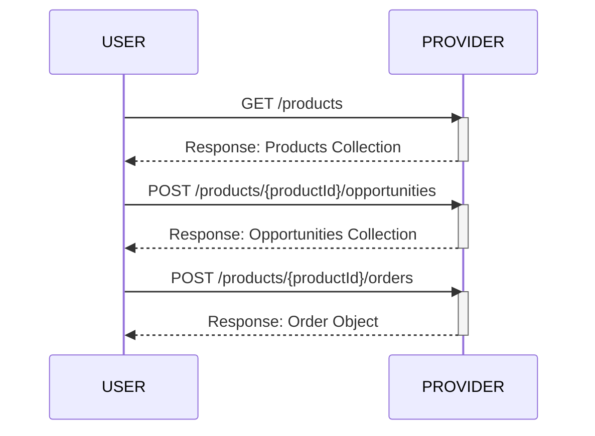
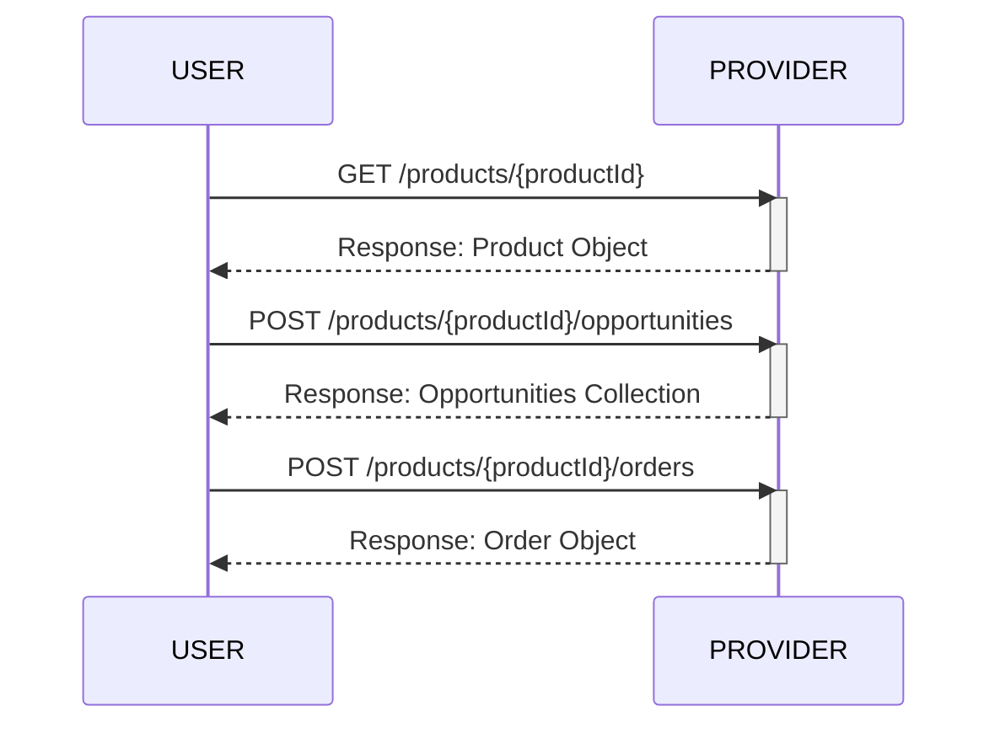
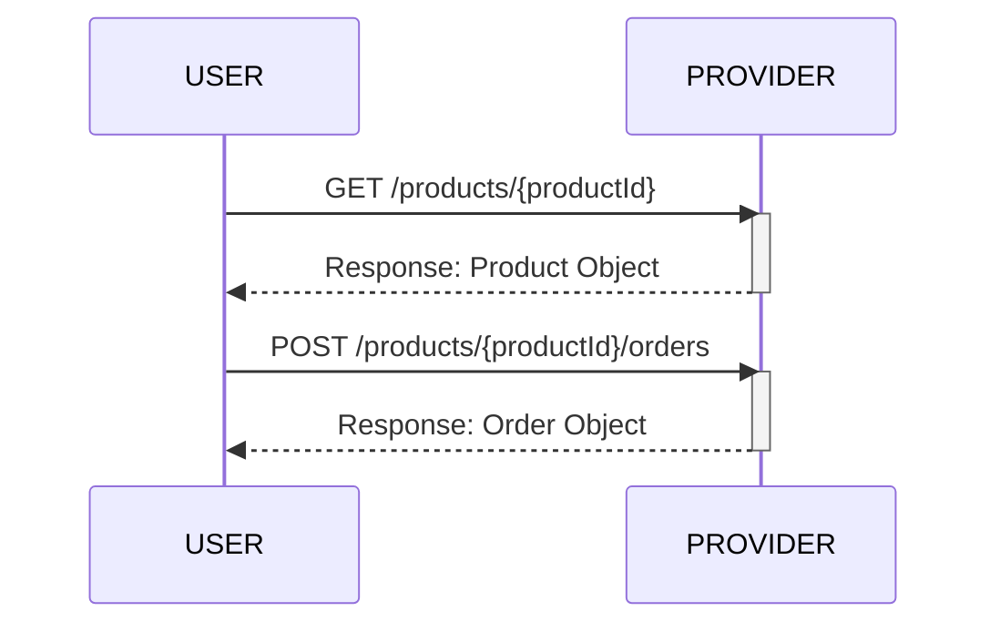
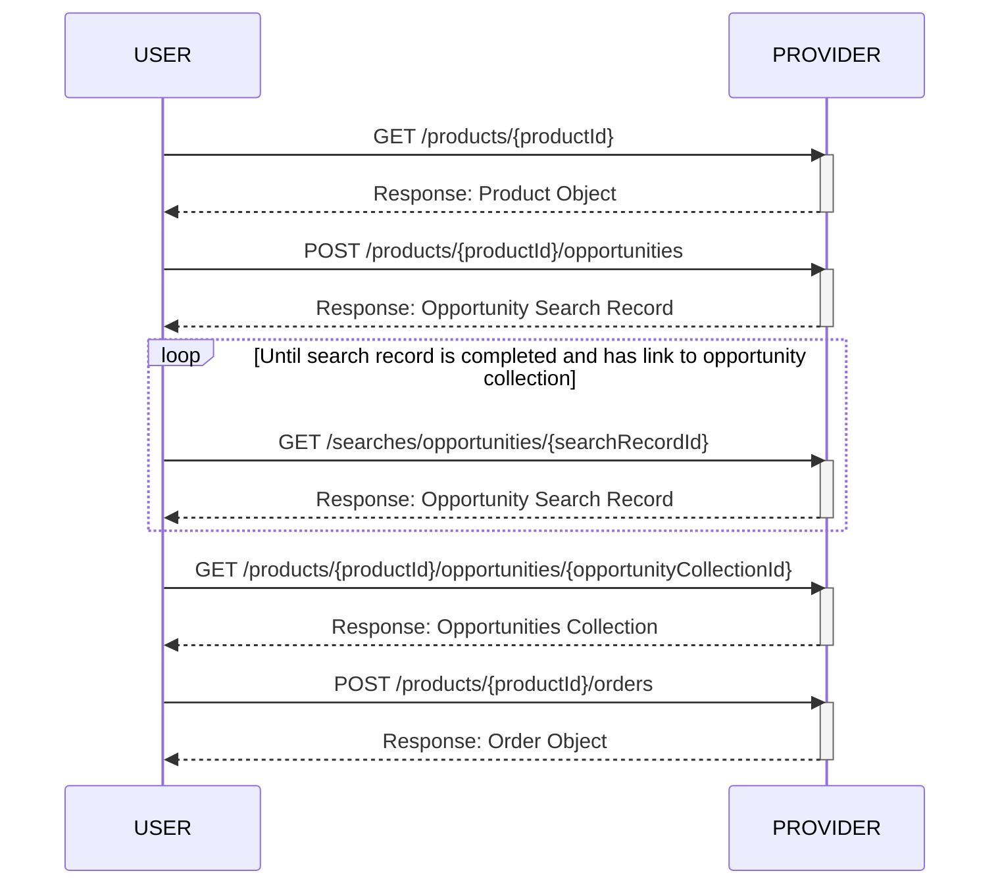

# Sensor Tasking API (STAPI)

The Sensor Tasking API (STAPI) defines a JSON-based web API to discover and order
spatio-temporal analytic and data products derived from remote sensing
(satellite or airborne) providers. The specification supports both products
derived from new tasking and products from provider archives.

The STAPI specification provides a structure and language to describe
[**Products**](product/README.md), [**Opportunities**](opportunity/README.md),
and [**Orders**](order/README.md), along with a REST API for interacting with 
data providers.

Generally speaking, users of STAPI will review available Products from one or
more providers, request Opportunities that are possible Orders for those
Products, and then submit one or more Orders to receive Products from Providers
represented by one or more data artifacts.

## Relationship to STAC

STAPI is seen as complementary to the SpatioTemporal Asset Catalog (STAC) specification.
While STAC is an API for searching and accessing data that exists in an archive,
STAPI is for ordering data that does not yet exist. This could be data to be collected
at a future time, but could also be data that needs to be processed and will be
delivered at a later time.

Orders are fulfilled by the creation of one or more STAC Items, although what is
ultimately delivered to the consumer may be something other than STAC metadata.

The major difference between existing data and future data is the uncertainty or
absence of metadata. The simple example of this is the datetime of the data.
Existing data has a discrete known datetime, whereas data to be collected
will have a date and time range during which it will be completed.

## Relationship to OGC API

The OGC API standards are used as API building blocks for STAPI. API Capabilities
are advertised through the use of [Conformance Classes](https://ogcapi.ogc.org/common/overview.html).
STAPI relies on conformance classes defined in OGC API - Common, as well as defining
it's own Conformance Class for core functionality. STAPI extensions define their
own Conformance Classes.

For more information on Conformance Classes used in STAPI see the [API Spec](API-SPEC.md).

## Example workflows

A user with broad requirements browses available products and orders based on
available opportunities.

A user with a specific product in mind views available opportunities and places
an order.

A user with a specific product and without a specific need in mind views
available products and places an order.

A user with a specific product in mind makes an async opportunities search
request, retrieves the available opportunities, and places an order.

