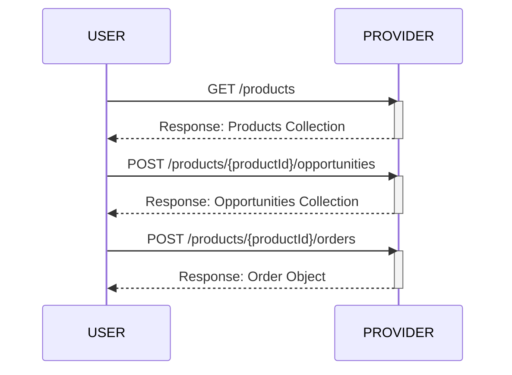
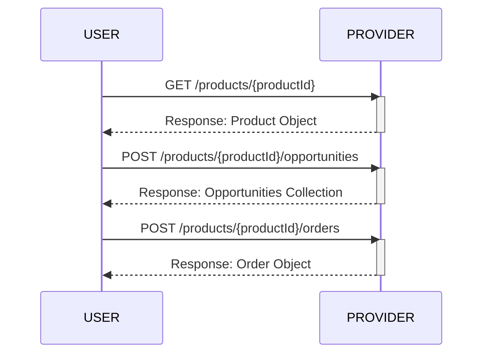
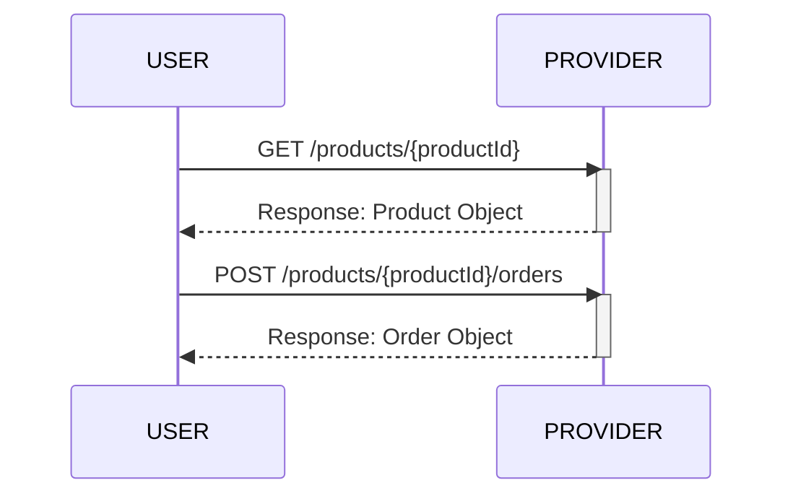

# Sensor Tasking API (STAPI)

## Table of Contents
- [Sensor Tasking API (STAPI)](#sensor-tasking-api-stapi)
  - [Table of Contents](#table-of-contents)
  - [About](#about)
  - [Introduction](#introduction)
  - [Other Documents](#other-documents)
  - [STAPI Description](#stapi-description)
    - [Core](#core)
      - [Landing Page](#landing-page)
        - [Relation Types](#relation-types)
    - [Opportunities](#opportunities)
  - [Endpoints](#endpoints)
  - [Conformance Classes](#conformance-classes)
    - [Conformance Class Table](#conformance-class-table)
  - [Pagination](#pagination)
  - [Example workflows](#example-workflows)

## About

The Sensor Tasking API (STAPI) defines a JSON-based web API to query for spatio-temporal analytic and data products derived from remote sensing (satellite or airborne) providers. The specification supports both products derived from new tasking and products from provider archives.

STAPI takes much of the work done by the STAC community and applies the lessons learned to this specification. The major departure from STAC is the requirement for uncertainty in many of the STAPI properties. For example, a user requesting a data product can provide a range of dates when they would like to capture. Conversely, a data provider cannot be certain of cloud cover in the future and must return a range of cloud cover probabilities to a user.

The STAPI specifications define several new entities: **Products**, **Opportunities**, and **Orders**. These are derived from the [SpatioTemporal Asset Catalog](https://github.com/radiantearth/stac-spec) (STAC) specification.

In many cases STAPI requests to providers will be ultimately fulfilled via delivery of a STAC Item, so STAPI aims to align with STAC core and extensions.

The core STAPI specification provides a structure and language to describe **Products**, **Opportunities**, and **Orders**. The process of interacting with a Product provider is done through a REST API.

## Introduction

Generally speaking, users of STAPI will review available Products from one or more providers, request Opportunities that are possible Orders for those Products, and then submit one or more Orders to receive Products from Providers represented by one or more data artifacts.

The STAPI is primarily designed around machine-to-machine interactions.

See the [Product README](product/README.md) for more.

## Other Documents

- [CHANGELOG](changelog.md)
- [ADRs](adrs.md)

## STAPI Description

### Core

- **Conformance URI:** <https://stapi.example.com/v0.1.0/core>
- [OpenAPI document](openapi.yaml)
- [Rendered API documentation](https://stapi-spec.github.io/stapi-spec/dev/)

The core of STAPI includes the `/products` endpoint and the `/orders` endpoint.

To know which parameters are available for which `productId`, users first explore [/products](./product).
These parameters can be used to form a POST to the `/products/{productId}/orders` endpoint.

#### Landing Page

- [Example](core/examples/landingpage.json)

Fields that can be included in the response body for `GET /`.

| Field Name  | Type            | Description                                                                                                                                                        |
| ----------- | --------------- | ------------------------------------------------------------------------------------------------------------------------------------------------------------------ |
| id          | string          | **REQUIRED.** Identifier for the API.                                                                                                                              |
| conformsTo  | \[string\]      | **REQUIRED.** Conformance classes that apply to the API globally.                                                                                                  |
| title       | string          | A short descriptive one-line title for the API.                                                                                                                    |
| description | string          | **REQUIRED.** Detailed multi-line description to fully explain the API. [CommonMark 0.29](http://commonmark.org/) syntax MAY be used for rich text representation. |
| links       | \[Link Object\] | **REQUIRED.** A list of references to other documents and endpoints.                                                                                               |

##### Relation Types

STAPI follows the principles of Hypermedia as the Engine of Application State (HATEOAS) by using link relations
to provide hypermedia navigation through the API. While STAPI also defines specific API endpoints that must be
implemented, these should also be discoverable by clients through various link relations. The only API endpoint
that a client should need to know of is the root endpoint, and the URLs for all other endpoints should come from
looking at link relations.

| Endpoint                                     | Relation Type      |
| -------------------------------------------- | ------------------ |
| `GET /conformance`                           | `conformance`      |
| `GET /products`                              | `products`         |
| `GET /products/{productId}`                  | `product`          |
| `GET /products/{productId}/queryables`       | `queryables`       |
| `GET /products/{productId}/order-parameters` | `order-parameters` |
| `POST /products/{productId}/orders`          | `create-order`     |
| `GET /products/{productId}/orders`           | `orders`           |
| `POST /products/{productId}/opportunities`   | `opportunities`    |
| `GET /orders`                                | `orders`           |
| `GET /orders/{orderId}`                      | `order`            |
| `GET /orders/{orderId}/status`               | `monitor`          |

`create-order`: A link with this relation type should only be provided in the landing page
if a user can directly go from the products to the order endpoint without
going through the `POST /products/{productId}/opportunities` endpoint.

### Opportunities

The `POST /products/{productId}/opportunities` endpoint provides additional functionality on top of core and is designed to be used
after `GET /products` and before `POST /products/{productId}/orders`. It allows users more fine-grained
control and selection of available tasking opportunities by letting them explore the opportunities which
are available for a chosen order configuration. The opportunities are
represented in a FeatureCollection, with order specific attributes and values in the feature properties.

## Endpoints

STAPI follow the modern web API practices of using HTTP Request Methods ("verbs") and
the `Content-Type` header to drive behavior on resources ("nouns") in the endpoints listed below.

The following table describes the service resources available in a STAPI implementation that
supports all three of the foundation specifications. Note that the 'Endpoint'
column is more of an example in some cases.

| Endpoint                                     | Specified in  | Accepts                                                            | Returns                                                                      | Description                                                                                                                                                                                                                         |
| -------------------------------------------- | ------------- | ------------------------------------------------------------------ | ---------------------------------------------------------------------------- | ----------------------------------------------------------------------------------------------------------------------------------------------------------------------------------------------------------------------------------- |
| `GET /`                                      | Core          | -                                                                  | [Landing Page](#landing-page)                                                |                                                                                                                                                                                                                                     |
| `GET /conformance`                           | Core          | -                                                                  | Conformance Classes                                                          |                                                                                                                                                                                                                                     |
| `GET /products`                              | Core          | -                                                                  | [Products Collection](./product/README.md)                                   | `productId`                                                                                                                                                                                                                         |
| `GET /products/{productId}`                  | Core          | -                                                                  | [Product](./product/README.md)                                               |                                                                                                                                                                                                                                     |
| `GET /products/{productId}/queryables`       | Core          | -                                                                  | JSON Schema                                                                  |                                                                                                                                                                                                                                     |
| `GET /products/{productId}/order-parameters` | Core          | -                                                                  | JSON Schema                                                                  |                                                                                                                                                                                                                                     |
| `GET /orders`                                | Core          | -                                                                  | [Orders Collection](./order/README.md#order-collection)                      |                                                                                                                                                                                                                                     |
| `GET /orders/{orderId}`                      | Core          | -                                                                  | [Order Object](./order/README.md#order-pobject)                              |                                                                                                                                                                                                                                     |
| `POST /products/{productId}/orders`          | Core          | [Order Request](./order/README.md#order-request) or any object     | -                                                                            | Order a capture with a particular set of [parameters](https://github.com/Element84/stapi-spec/blob/main/product/README.md#parameters) as defined in the products or a request that was provided through the opportunities endpoint. |
| `POST /products/{productId}/opportunities`   | Opportunities | [Opportunity Request](./opportunity/README.md#opportunity-request) | [Opportunities Collection](./opportunity/README.md#opportunities-collection) | Explore the opportunities available for a particular set of [parameters](https://github.com/Element84/stapi-spec/blob/main/product/README.md#parameters)                                                                            |

## Conformance Classes

STAPI utilizes OGC API Features [Conformance](http://docs.opengeospatial.org/is/17-069r3/17-069r3.html#_declaration_of_conformance_classes)
JSON structure. For STAPI, we declare new STAPI conformance classes, with the core ones detailed in the table below.

The core STAPI conformance classes communicate the conformance JSON only in the root (`/`) document, while OGC API
requires they also live at the `/conformance` endpoint. STAPI's conformance structure is detailed in the
[core](core/). Note all conformance URIs serve up a rendered HTML version of the corresponding OpenAPI document at the given location.

### Conformance Class Table

| **Name**                           | **Specified in**                       | **Conformance URI**                                                     | **Description**                                                                          |
| ---------------------------------- | -------------------------------------- | ----------------------------------------------------------------------- | ---------------------------------------------------------------------------------------- |
| STAPI - Core                       | Core                                   | https://stapi.example.com/v0.1.0/core                                   | Specifies the STAPI Landing page `/`, communicating conformance and available endpoints. |
| STAPI - Opportunities              | [Opportunities](opportunity/README.md) | https://stapi.example.com/v0.1.0/opportunities                          | Enables request of potential tasking opportunities                                       |
| CQL2 JSON                          | CQL2                                   | http://www.opengis.net/spec/cql2/1.0/conf/cql2-json                     | Allows using CQL2 formatted as JSON                                                                   |
| Basic-CQL2                         | CQL2                                   | http://www.opengis.net/spec/cql2/1.0/conf/basic-cql2                    | Allows using logical operators (AND, OR, NOT) and comparison operators (=, <>, <, <=, >, >=), and IS NULL with string, numeric, boolean, date, and datetime types.                   |
| CQL2 Basic Spatial Functions       | CQL2                                   | http://www.opengis.net/spec/cql2/1.0/conf/basic-spatial-functions          | Allows using spatial intersects (`s_intersects`) operator                                |
| CQL2 Advanced Comparison Operators | CQL2                                   | http://www.opengis.net/spec/cql2/1.0/conf/advanced-comparison-operators | Allows using operators `LIKE`, `BETWEEN` and `IN`                                        |
| GeoJSON Point                      | GeoJSON                                | https://geojson.org/schema/Point.json                                   | Allows submitting orders with GeoJSON points                                             |
| GeoJSON LineString                 | GeoJSON                                | https://geojson.org/schema/LineString.json                              | Allows submitting orders with GeoJSON linestrings                                        |
| GeoJSON Polygon                    | GeoJSON                                | https://geojson.org/schema/Polygon.json                                 | Allows submitting orders with GeoJSON polygons                                           |
| GeoJSON MultiPoint                 | GeoJSON                                | https://geojson.org/schema/MultiPoint.json                              | Allows submitting orders with GeoJSON multi points                                       |
| GeoJSON MultiPolygon               | GeoJSON                                | https://geojson.org/schema/MultiPolygon.json                            | Allows submitting orders with GeoJSON multi polygons                                     |
| GeoJSON MultiLineString            | GeoJSON                                | https://geojson.org/schema/MultiLineString.json                         | Allows submitting orders with GeoJSON multilinestring                                    |

It is required to support the CQL2 JSON, Basic CQL2, and CQL2 Basic Spatial Operators classes.
Other [CQL2 Conformance classes](https://docs.ogc.org/is/21-065r2/21-065r2.html) may be supported at the
discretion of the implementer. 

See [the STAPI Demo](https://github.com/Element84/stat-api-demo) for an example of advertising these
conformance classes.

## Pagination

STAPI supports paging through hypermedia links for the following resources:
- `GET /products`
- `POST /products/{productId}/opportunities`
- `GET /orders`
- `GET /orders/{orderId}/statuses`

The following relation types are available for pagination:
- `next` to provide a link to the next page
- `prev` to provide a link to the previous page (optional)
- `first` to provide a link to the first page (optional)
- `last` to provide a link to the last page (optional)

This link href must contain any request parameters that are necessary
for the implementation to understand how to provide the next page of results,
e.g., the query parameters `page`, `next`, or `token`.

For example, the links array could look like this for a API that supports
a parameter `page` and is currently on page 2:

```json
    "links": [
        {
            "rel": "prev",
            "type": "application/json",
            "href": "https://stapi.example.com/products?page=1",
            "title": "Next page"
        },
        {
            "rel": "next",
            "type": "application/json",
            "href": "https://stapi.example.com/products?page=3",
            "title": "Next page"
        }
    ]
```

The href may contain any arbitrary URL parameter, which is implementation-specific:

- `https://stac-api.example.com/collections/my_collection/items?page=2`
- `https://stac-api.example.com/collections/my_collection/items?next=8a35eba9c`
- `https://stac-api.example.com/collections/my_collection/items?token=f32890a0bdb09ac3`

In addition to supporting query parameters in the URL value of the `href` field,
the Link object can contain additional fields to support more complex HTTP requests:
- `method` to specify an HTTP method in uppercase (e.g. `GET` or `POST`),
- `headers` to add HTTP headers in the request,
- `body` with the entire body for the request.

The specification is compatible to pagination mechanisms defined in STAC API.

## Example workflows

A user with broad requirements browses available products and orders based on available opportunities.



A user with a specific product in mind views available opportunities and places and order.



A user with a specific product and without a specific need in mind views available products and places an order.


