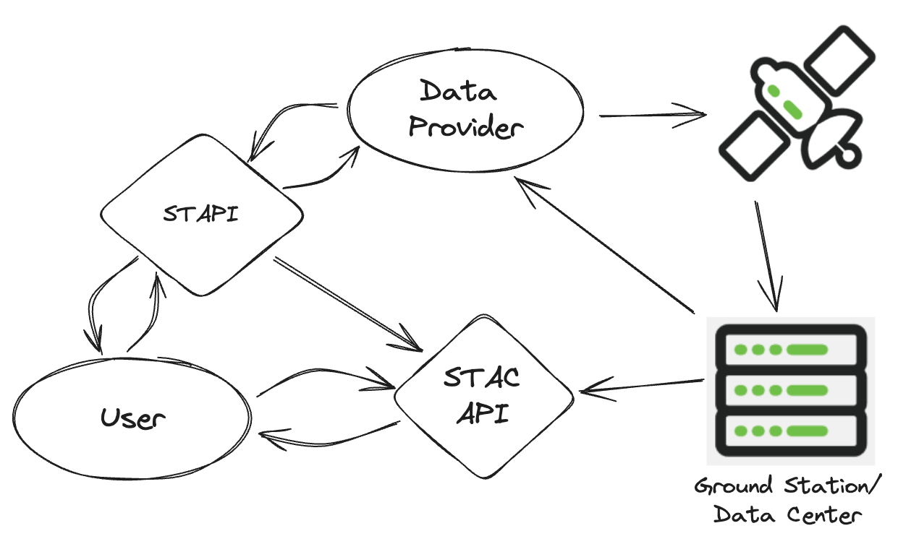

# STAPI: Sensor Tasking API

Welcome to the Sensor Tasking API (STAPI) specification documentation.

## What is STAPI?

The Sensor Tasking API (STAPI) defines a JSON-based web API to discover and
order spatio-temporal analytic and data products derived from remote sensing
(satellite or airborne) providers. The specification supports both products
derived from new tasking and products from provider archives.

## Quick Links

- [Introduction](intro.md) - Learn about STAPI and its ecosystem
- [API Specification](spec/README.md) - Detailed API documentation
- [API Reference](api.md) - Interactive OpenAPI documentation
- [GitHub Repository](https://github.com/stapi-spec/stapi-spec) - Source code
  and issue tracking

## High-level Overview

STAPI provides a structure and language to describe:

- **[Products](spec/product/README.md)** - Available data products from providers
- **[Opportunities](spec/opportunity/README.md)** - Possible orders for those products
- **[Orders](spec/order/README.md)** - Submitted requests to receive products

Generally speaking, users of STAPI will:

1. Review available Products from one or more providers
1. Request Opportunities that are possible Orders for those Products
1. Submit one or more Orders to receive Products from Providers

## Community

Join our community and contribute to the development of STAPI:

- [GitHub Discussions](https://github.com/stapi-spec/stapi-spec/discussions)
- [Issue Tracker](https://github.com/stapi-spec/stapi-spec/issues)
